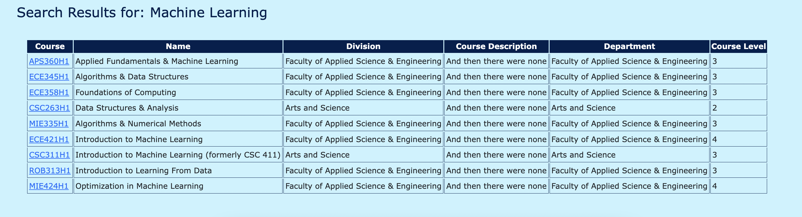

# CARTE Education Pathways

This repo is a clone of https://github.com/nelaturuk/education_pathways with changes made by Lakmal Pinnaduwage and Yida Chen.

# Activity 1

# Activity 2-5

Home Page

Results Page - Form

Results Page - Results Table

# Activity 6

User Story 3.1.1 - As a student, I want to learn if a course is required for a specific minor or certificate that I am interested in so that I can better prioritize these courses for the successful completion of my academic minor or certificate goals. 

User Story 3.2.1 - As a student, I want to see which courses can be useful in the pursuit of various career paths available post-graduation, so I can tailor my searches to these career goals 

User Story 3.2.2 - As a student, being able to see courses grouped into central themes like machine learning, data science, system-on-chip (SOC) design, etc. would greatly help in planning out future enrollments suited to my needs 

